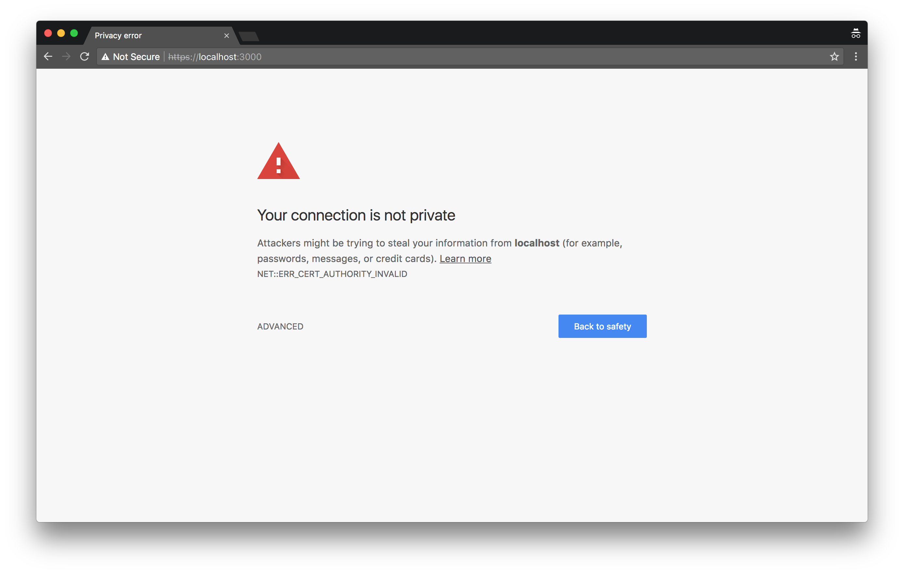
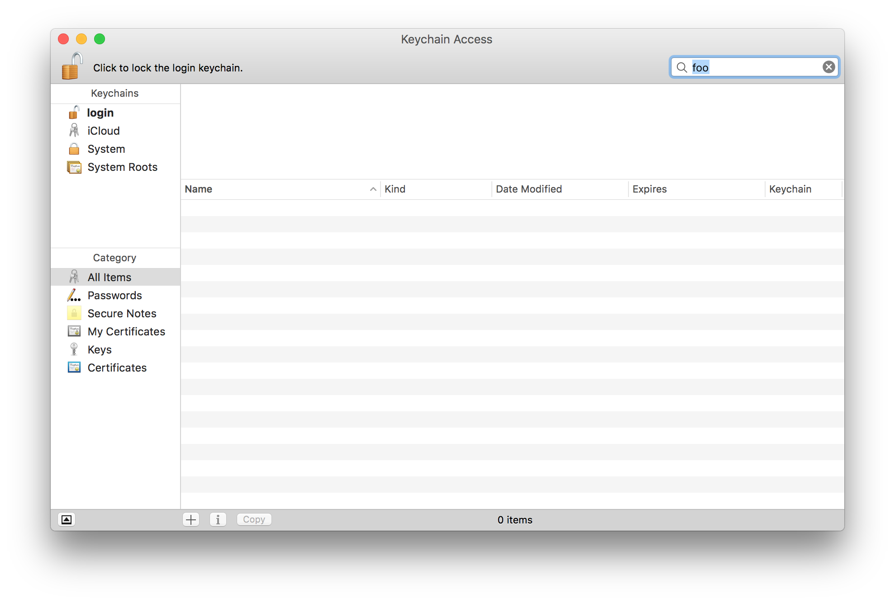
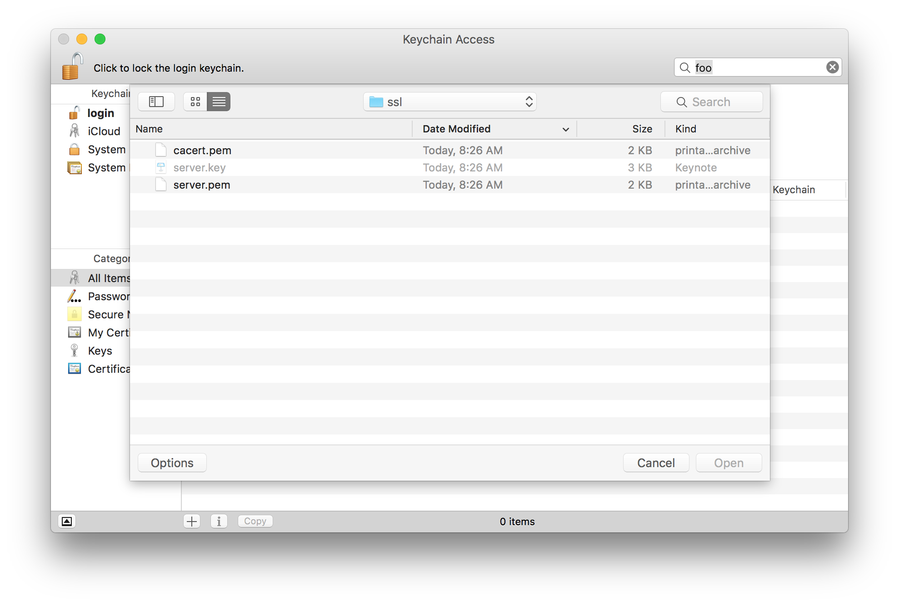
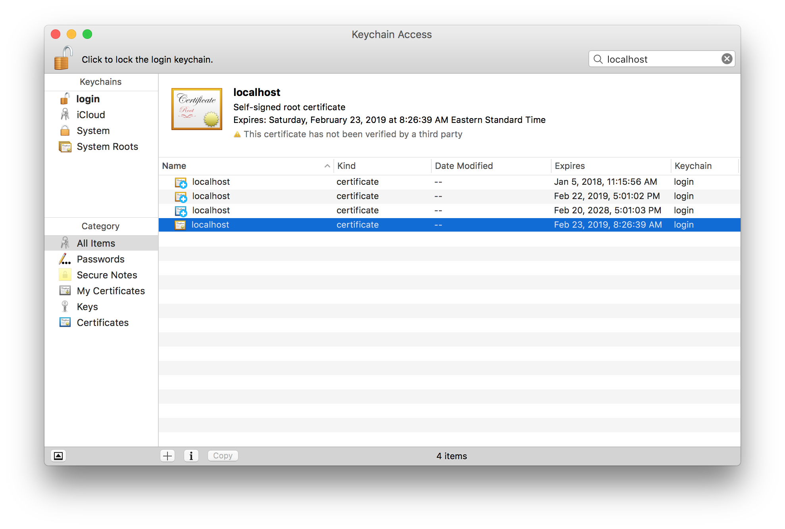
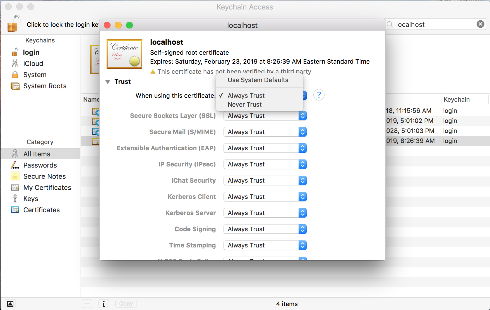

# Configure Local CA CERT with MacOS

## 1. The warning you receive while developing locally.

## 2. Open the keychain app.

## 3. Use File --> Import to add the ca cert you've already created.

## 4. Once added, locate it via the search box.

## 5. Set to always trust.

## 6. Reload the webpage.

