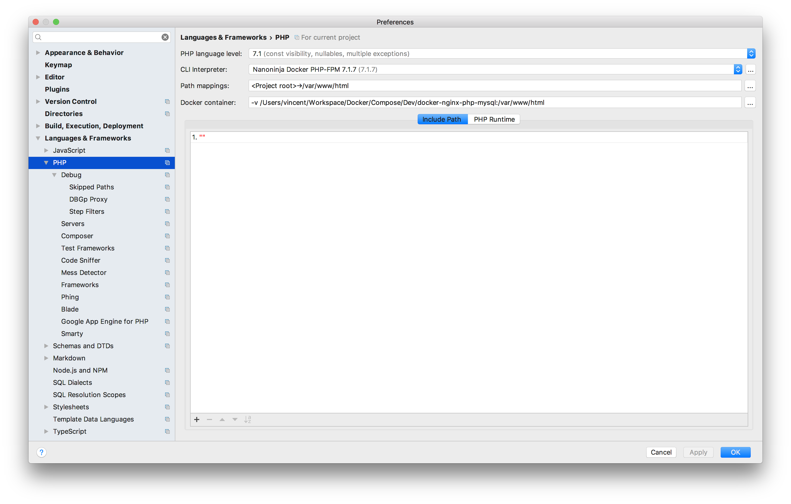
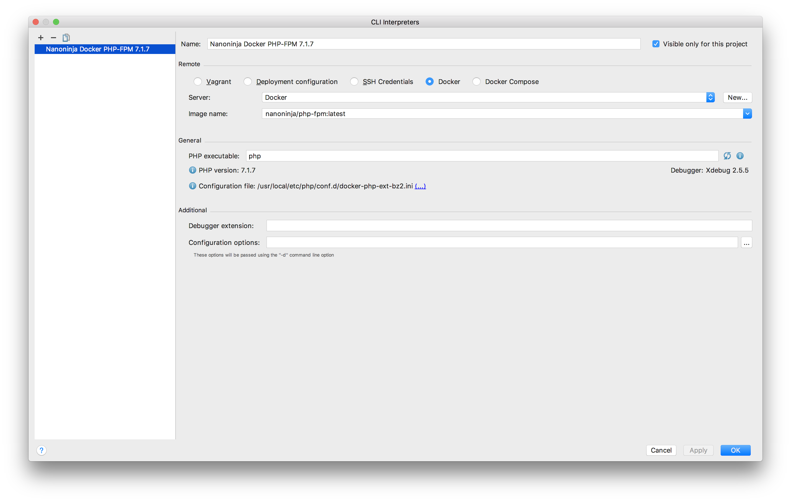
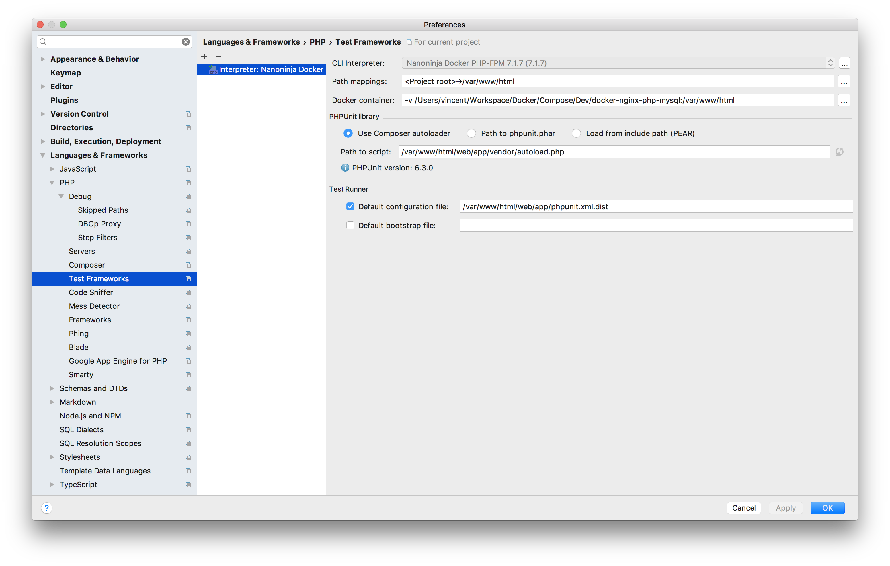
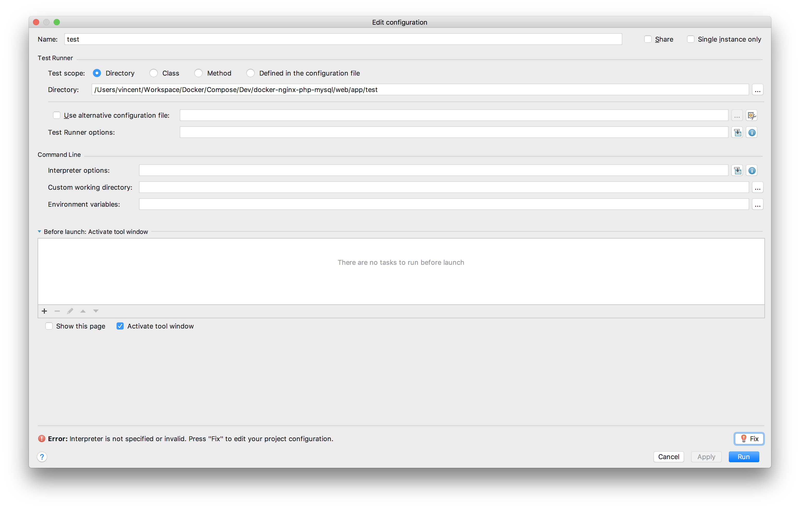
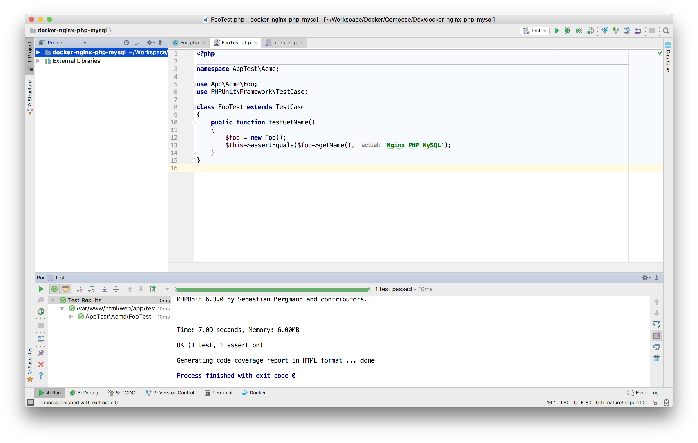
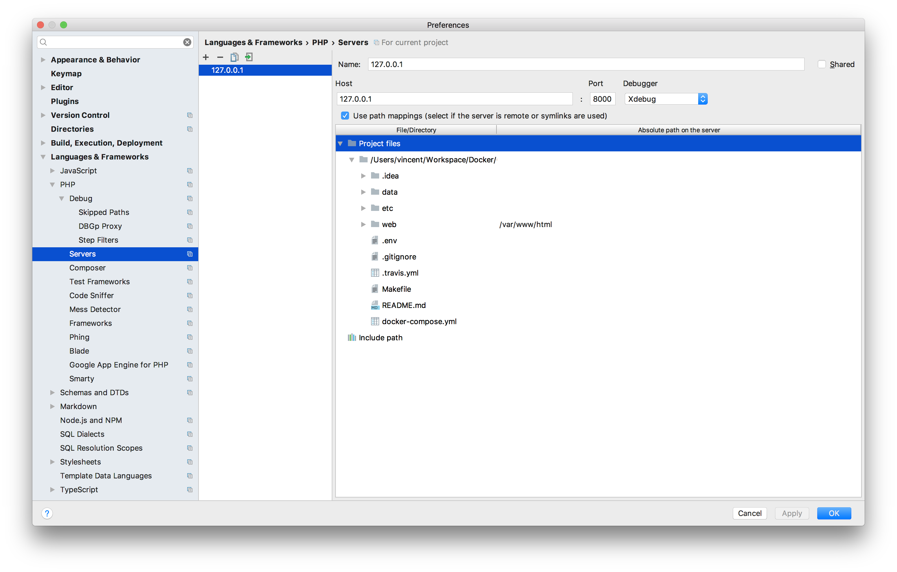
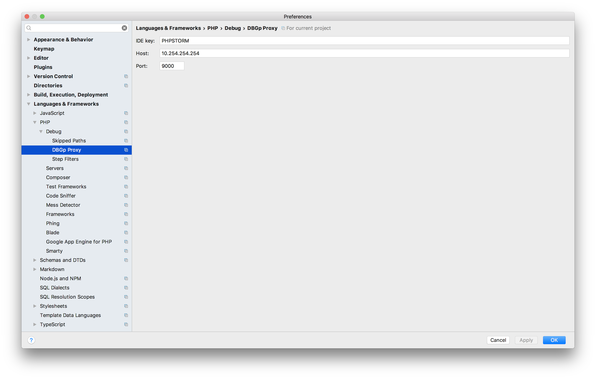
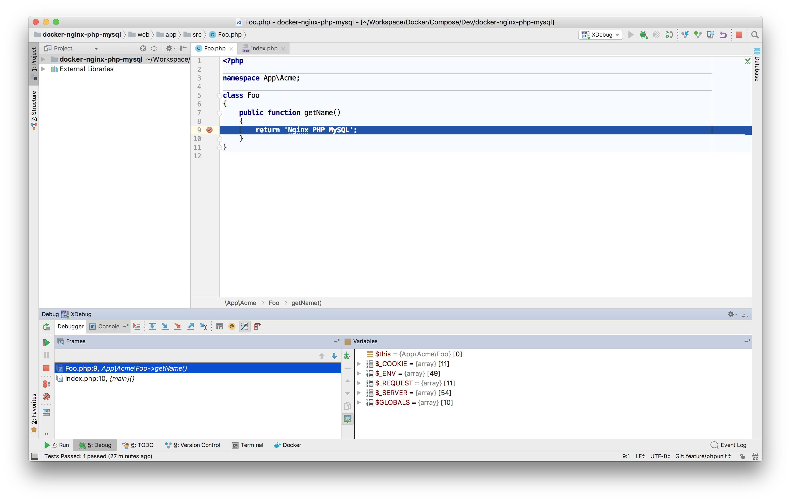

# Configure PHPStorm with MacOS

Inspired from this following links :

- [Running PHPUnit Tests in PhpStorm with Docker](https://www.youtube.com/watch?v=I7aGWO6K3Ho)
- [All hail Xdebug and lets let var dump die](http://jamescowie.me/blog/2016/12/all-hail-xdebug-and-lets-let-var-dump-die/)

## Edit PHP configuration



## Add a PHP interpreter



## Configure PHPUnit



### Add test configuration



### PHPUnit Demo



## Configure XDebug

### Edit `etc/php.ini` file

Add this following lines :

```sh
[xdebug]
xdebug.remote_host = 10.254.254.254
xdebug.remote_port = 9000
xdebug.remote_autostart=1
xdebug.idekey = PHPSTORM
xdebug.remote_enable = 1
xdebug.remote_connect_back = 0
xdebug.profiler_enable = 1
```

### Check Debug section


### Add a debug server



### Configure XDebug Proxy

Create an IP Alias :

```sh
sudo ifconfig en0 alias 10.254.254.254 255.255.255.0
```



To delete an IP Alias : 

```sh
sudo ifconfig en0 -alias 10.254.254.254
```

### XDebug Demo

